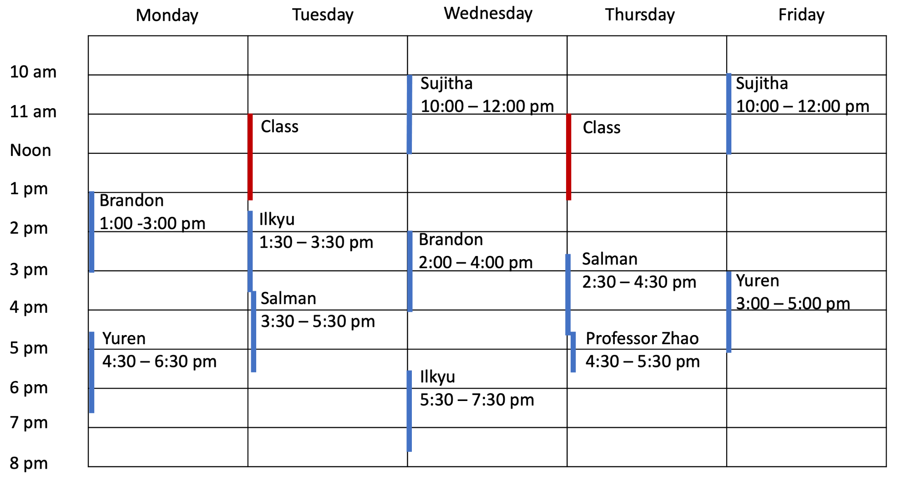

## INSTRUCTIONAL TEAM 
### INSTRUCTOR  
Assistant Professor Yuhang Zhao 

### TEACHING ASSISTANTS  
Brandon Cegelski, Ru Wang

### PEER MENTORS  
Ilkyu Ju, Nick Winans

---

## CONTACT
The best way to contact the instructional team is contacting them through the course Microsoft Teams channel or visiting office hours (below).

---

## OFFICE HOURS  
Instructional team office hours will follow the schedule below between **Jan 25** and **May 6** and held via Microsoft Teams. For questions regarding assignments, TA and peer-mentor office hours are recommended. For questions regarding grading, TA office hours are recommended. For all other questions, instructor office hours are recommended.

TBD

<!--  -->